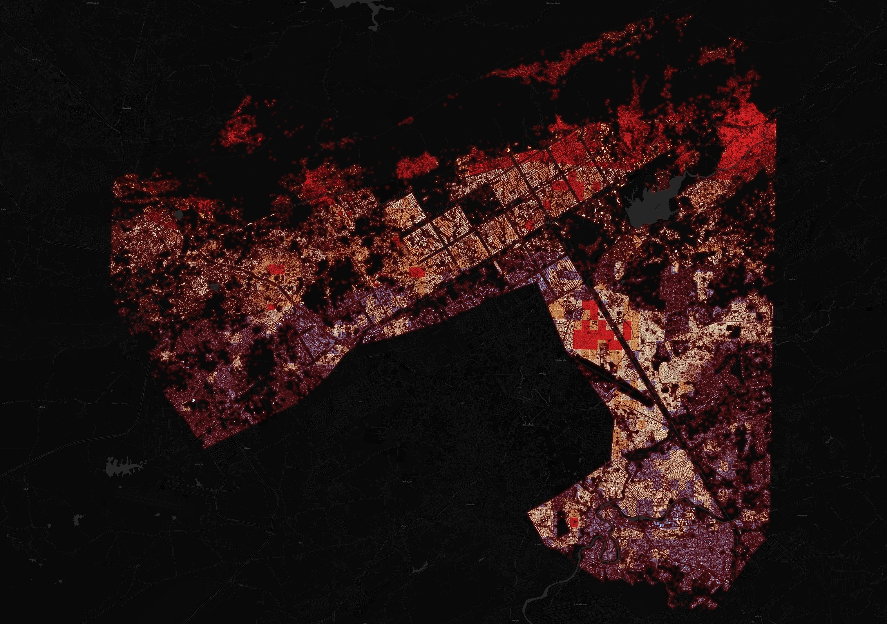

# Islamabad Seismic Risk & Vulnerability Mapping

[](https://taimoorgeo.github.io/islamabad-seismic-risk/)
[](https://qgis.org/)

An open-source, macro-level geospatial framework designed to identify and visualize potential seismic vulnerability zones within Islamabad, Pakistan. This project implements a **Multi-Criteria Evaluation (MCE)** model integrated into a lightweight, interactive WebGIS dashboard.


*Figure 1: Macro-level vulnerability grid processing within the QGIS environment.*

---

## 🚀 Core Objective

The primary goal of this pipeline is to model structural and geographic susceptibility by intersecting tectonic hazard zones, soil amplification profiles, and built-environment density. The final web deployment deliberately isolates the **Top 5% Most Critical Seismic Vulnerability Zones** to assist in macro-scale risk allocation and emergency evacuation prioritizing.

---

## 📊 Analytical Methodology & Data Matrix

Vulnerability calculations are executed at a grid level by compounding three weighted spatial risk variables:

| Risk Factor | Data Source | Spatial Operation | Technical Implication |
| :--- | :--- | :--- | :--- |
| **1. Fault Risk (0–3)** | Public Tectonic Catalogs | Proximity Buffer / Euclidean Distance | Measures structural exposure to the active **Margalla Fault Line**. |
| **2. Building Density (0–5)** | OpenStreetMap Footprints | Kernel Density Estimation (KDE) | Identifies structural congestion impacting evacuation choke points. |
| **3. Soil Type (1–2)** | FAO Legacy Soil Map | Vector Attribute Classification | Accounts for macro-level soft soil profiles that amplify seismic waves. |

### The Compounding Risk Formula
$$\text{Overall Vulnerability} = \text{Fault Risk} + \text{Building Density} + \text{Soil Type}$$

---

## ⚠️ Data Integrity & Current Limitations

> **Engineering Note on Ground-Truthing:**  
> This model operates strictly as a **macro-level spatial framework** using publicly available global datasets (including legacy FAO soil profiles). 
> 
> * **No Local Ground-Truthing:** Geotechnical borehole validation, localized shear-wave velocity ($V_{s30}$) profiles, and site-specific structural integrity audits were **not** performed.
> * **Operational Scope:** This asset is intended for preliminary spatial scoping, regional vulnerability trends, and conceptual portfolio demonstration. It must not be utilized for site-specific structural design or localized civil engineering construction clearances.

---

## 📂 Repository Structure

```text
├── index.html               # Leaflet/Mapbox WebGIS Application code
├── assets/
│   ├── css/                 # Custom styling for dashboard UI overlays
│   └── data/                # Vector GeoJSON/Topographical payload files
└── documentation/
    └── spatial_layers.md    # Deeper breakdown of the QGIS MCE parameters
